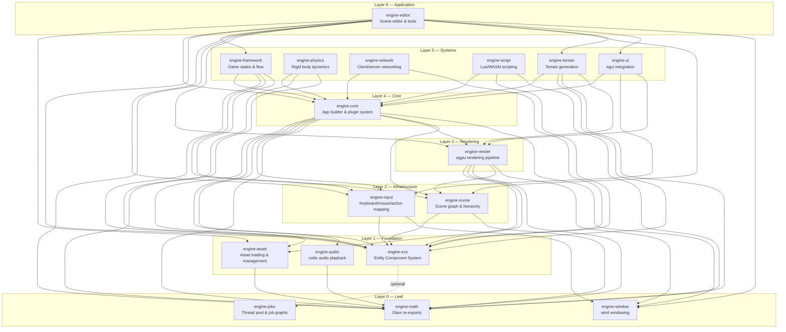
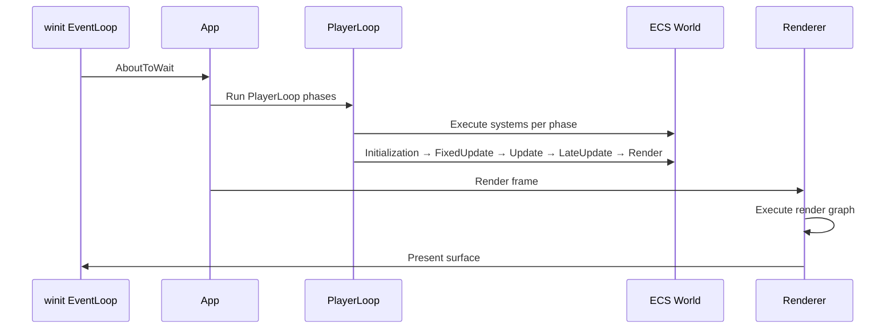
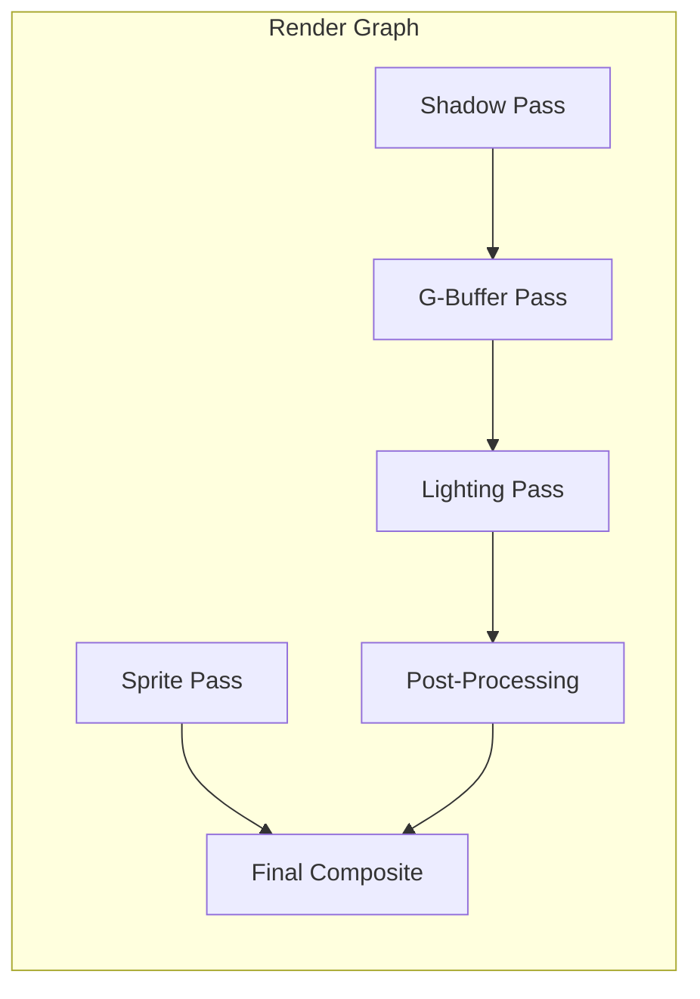

# Architecture Overview

RustEngine is a modular game engine built in Rust with 17 crates organized in layers. This document describes the high-level architecture, crate relationships, and data flow.

## Unity-like API

RustEngine includes a Unity-inspired API for game object management, component systems, and lifecycle callbacks. Key concepts:

- **GameObject**: Entity with name, tag, layer, and component list
- **Component**: Trait for data containers with lifecycle callbacks
- **MonoBehaviour**: Script with Update, FixedUpdate, LateUpdate, and other callbacks
- **Transform**: Local/world transform synchronization
- **PlayerLoop**: Phase-based execution matching Unity's execution order
- **EventBus**: Type-safe event system for decoupled communication

## Validated Dependency Layers

All inter-crate dependencies flow downward only. No circular or upward dependencies exist (verified via `cargo tree`).

```
Layer 0 (Leaf):           engine-math, engine-jobs, engine-window
Layer 1 (Foundation):     engine-audio, engine-asset, engine-ecs
Layer 2 (Infrastructure): engine-scene, engine-input
Layer 3 (Rendering):      engine-render
Layer 4 (Core):           engine-core
Layer 5 (Systems):        engine-framework, engine-physics, engine-network,
                          engine-script, engine-ui, engine-terrain
Layer 6 (Application):    engine-editor
```

## Crate Dependency Graph



## Layer Descriptions

### Layer 0 — Leaf

No engine-* dependencies. Pure utility crates.

| Crate | Purpose | Key Dependencies |
|-------|---------|-----------------|
| **engine-math** | Re-exports `glam` types (`Vec2/3/4`, `Mat4`, `Quat`) with extension traits | `glam` |
| **engine-jobs** | Thread pool, job graphs, task scheduling | `crossbeam`, `rayon` |
| **engine-window** | Window creation via winit 0.30 | `winit` |

### Layer 1 — Foundation

Depend only on Layer 0 crates.

| Crate | Purpose | Key Dependencies |
|-------|---------|-----------------|
| **engine-audio** | Audio playback via rodio, mixer buses, spatial audio, streaming | `rodio`, engine-math |
| **engine-asset** | Asset handles (`Arc` ref-counting), type registry, file watcher, loaders (image, glTF, audio) | `notify`, `image`, `gltf`, engine-math |
| **engine-ecs** | Sparse-set ECS: entities, components, queries, schedules | `rayon`, optional engine-jobs |

### Layer 2 — Infrastructure

Depend on Layers 0–1.

| Crate | Purpose | Key Dependencies |
|-------|---------|-----------------|
| **engine-scene** | Scene nodes, parent-child hierarchy, Transform/GlobalTransform sync, prefabs, animation state | engine-ecs, engine-math |
| **engine-input** | Keyboard/mouse state tracking, action maps, input bindings | engine-ecs, engine-window |

### Layer 3 — Rendering

Depend on Layers 0–2.

| Crate | Purpose | Key Dependencies |
|-------|---------|-----------------|
| **engine-render** | wgpu renderer, render graph, sprite/PBR pipelines, camera, lighting, shadows, particles, tilemap | `wgpu`, engine-asset, engine-ecs, engine-math, engine-scene, engine-window |

### Layer 4 — Core

Depend on Layers 0–3. Central integration point.

| Crate | Purpose | Key Dependencies |
|-------|---------|-----------------|
| **engine-core** | `AppBuilder`, plugin system, time management, config, logging, profiler, Unity-like API (GameObject, MonoBehaviour, PlayerLoop, EventBus) | engine-asset, engine-audio, engine-ecs, engine-input, engine-math, engine-render, engine-scene, engine-window, libloading, serde, serde_json |

### Layer 5 — Systems

Depend on engine-core (Layer 4) and lower layers.

| Crate | Purpose | Key Dependencies |
|-------|---------|-----------------|
| **engine-framework** | Game state stack, standard game flow (title→menu→game→pause→gameover), save system | engine-core, engine-ecs, engine-input, engine-scene |
| **engine-physics** | Rigid bodies, colliders, collision detection (SAT), contact solving, joints, CCD | engine-core, engine-ecs, engine-math |
| **engine-network** | Message serialization, client/server, authoritative mode, snapshot sync, NAT traversal | engine-core, engine-ecs |
| **engine-script** | Lua (mlua) and WASM scripting, component bridge, hot-reload, event bus | `mlua`, `wasmtime`, engine-core, engine-ecs, engine-math |
| **engine-ui** | egui integration, theming, layout, retained mode widgets, animations | `egui`, engine-core, engine-input, engine-render |
| **engine-terrain** | Terrain generation, LOD, chunking | engine-core, engine-ecs, engine-math, engine-render |

### Layer 6 — Application

Depend on all lower layers.

| Crate | Purpose | Key Dependencies |
|-------|---------|-----------------|
| **engine-editor** | Scene editor UI, hierarchy panel, inspector, gizmos, undo/redo, scene serialization | engine-asset, engine-core, engine-ecs, engine-framework, engine-input, engine-math, engine-render, engine-scene, engine-terrain, engine-ui, engine-window |

## Data Flow

### Frame Lifecycle (PlayerLoop)

RustEngine uses a Unity-like PlayerLoop for phase-based execution:



### PlayerLoop Phases

Systems are registered for specific phases (matching Unity's execution order):

1. **Initialization** — Time, input setup
2. **PreFixedUpdate** — Before fixed timestep
3. **FixedUpdate** — Physics, animation (fixed timestep)
4. **PostFixedUpdate** — After fixed timestep
5. **PreUpdate** — Before main update
6. **Update** — Main game logic, input handling
7. **PostUpdate** — After main update
8. **PreLateUpdate** — Before late update
9. **LateUpdate** — Camera follow, final adjustments
10. **PostLateUpdate** — After late update
11. **Render** — Rendering systems
12. **AfterRender** — Post-render cleanup
13. **Cleanup** — Final cleanup

### Event System

Type-safe event dispatch via `EventBus`:

```rust
// Register handler
ctx.events.on_event::<CollisionEvent>(|event, ctx| {
    println!("Collision: {:?} vs {:?}", event.entity_a, event.entity_b);
});

// Send event
ctx.events.send(CollisionEvent { entity_a, entity_b }, &mut ctx);
```

### Render Pipeline



## Plugin System

The engine uses a plugin architecture for modularity:

### Static Plugins

```rust
use engine_core::app::AppBuilder;
use engine_core::plugin::Plugin;

struct MyPlugin;

impl Plugin for MyPlugin {
    fn build(&self, app: &mut AppBuilder) {
        // Register systems, resources, event handlers
        app.add_system(my_system);
        app.insert_resource(MyResource::default());
    }
}
```

Plugins can:
- Register ECS systems (startup, update, render)
- Insert global resources
- Register event handlers
- Configure the renderer
- Add custom asset loaders

### Dynamic Plugins

Load plugins at runtime from shared libraries:

```json
// plugin.json manifest
{
    "name": "my-plugin",
    "version": "1.0.0",
    "description": "My awesome plugin",
    "author": "Developer",
    "entry_point": "create_plugin",
    "engine_version": ">=0.1.0",
    "dependencies": {}
}
```

```rust
// Load dynamic plugins
app.load_dynamic_plugins(Path::new("plugins/"))?;

// Or use stored plugins for deferred execution
app.add_plugin_stored(MyPlugin);
```

Dynamic plugins:
- Are compiled as shared libraries (.dll, .so, .dylib)
- Use `libloading` for runtime loading
- Have version compatibility checking
- Can be installed/uninstalled without recompilation

## Unity-like API

RustEngine includes a Unity-inspired API for game development:

### Core Concepts

**GameObject** - Entity with components:
```rust
use engine_core::gameobject::GameObject;

let mut go = GameObject::new("Player");
go.set_tag("Player");
go.set_layer(1);
go.add_component(Transform::from_xyz(0.0, 0.0, 0.0));
```

**Component** - Data container with lifecycle:
```rust
use engine_core::gameobject::Component;

#[derive(Debug)]
struct Health {
    current: f32,
    max: f32,
}

impl Component for Health {
    fn on_added(&mut self, handle: GameObjectHandle) {
        println!("Health added to {:?}", handle);
    }
}
```

**MonoBehaviour** - Script with callbacks:
```rust
use engine_core::monobehaviour::MonoBehaviour;

struct PlayerController {
    speed: f32,
}

impl MonoBehaviour for PlayerController {
    fn update(&mut self, context: &mut Context) {
        // Game logic here
    }
    
    fn on_collision_enter(&mut self, context: &mut Context, collision: &Collision) {
        // Handle collision
    }
}
```

**Transform** - Local/world synchronization:
```rust
use engine_core::transform::Transform;

let mut transform = Transform::from_xyz(1.0, 2.0, 3.0);
transform.set_position(Vec3::new(4.0, 5.0, 6.0));
// World transform automatically computed from parent hierarchy
```

**World** - GameObject container:
```rust
use engine_core::world::World;

let mut world = World::new();
let handle = world.spawn(GameObject::new("Player"));
let go = world.get_gameobject(handle).unwrap();
```

**ScriptableObject** - Data assets:
```rust
use engine_core::scriptable_object::ScriptableObject;

#[derive(Serialize, Deserialize)]
struct WeaponData {
    name: String,
    damage: f32,
}

impl ScriptableObject for WeaponData {
    fn name(&self) -> &str { &self.name }
}
```

**Prefab** - Reusable GameObject templates:
```rust
use engine_core::prefab::Prefab;

let prefab = Prefab::new("Enemy");
// Instantiate multiple times with overrides
```

**AssetDatabase** - Centralized asset management:
```rust
use engine_core::asset_database::AssetDatabase;

let mut db = AssetDatabase::new();
let handle = db.create_asset("player_data", PlayerData { health: 100 });
let asset = db.get_asset::<PlayerData>(&handle);
```

**Serialization** - Scene and prefab saving/loading:
```rust
use engine_core::serialization::{SceneSerializer, SceneDeserializer};

// Serialize scene
let serializer = SceneSerializer::new();
let json = serializer.serialize(&world)?;

// Deserialize scene
let deserializer = SceneDeserializer::new();
let world = deserializer.deserialize(&json)?;
```

**UndoSystem** - Undo/redo for editor operations:
```rust
use engine_core::undo::{UndoSystem, UndoCommand};

let mut undo_system = UndoSystem::new(100); // 100 history depth
undo_system.execute(CreateGameObjectCommand::new("Player"), &mut world);
undo_system.undo(&mut world); // Undo creation
undo_system.redo(&mut world); // Redo creation
```

### World Types

RustEngine has two World types:

1. **`engine_core::World`** - GameObject container (Unity-like API)
   - Stores GameObjects with components
   - Provides spawn/despawn/find operations
   - Used with MonoBehaviour and PlayerLoop

2. **`engine_ecs::World`** - ECS World (traditional ECS)
   - Sparse-set component storage
   - Used with ECS systems and queries
   - Lower-level API for performance-critical code

Most game code uses `engine_core::World` for the Unity-like API. Use `engine_ecs::World` only when you need direct ECS access for performance.

### Execution Order

The PlayerLoop ensures consistent execution order:

1. **Initialization** - Setup systems
2. **FixedUpdate** - Physics, animation (fixed timestep)
3. **Update** - Main game logic
4. **LateUpdate** - Camera follow, final adjustments
5. **Render** - Rendering systems

### Event System

Type-safe decoupled communication:
```rust
// Define event
#[derive(Clone)]
struct DamageEvent {
    amount: f32,
}
impl Event for DamageEvent {}

// Register handler
ctx.events.on_event::<DamageEvent>(|event, ctx| {
    println!("Damage: {}", event.amount);
});

// Send event
ctx.events.send(DamageEvent { amount: 10.0 }, &mut ctx);
```

### Built-in Events

RustEngine includes Unity-like built-in events:

- **Collision**: `CollisionEnter`, `CollisionExit`, `CollisionStay`
- **Trigger**: `TriggerEnter`, `TriggerExit`, `TriggerStay`
- **Mouse**: `MouseEnter`, `MouseExit`, `MouseDown`, `MouseUp`, `MouseDrag`, `MouseOver`
- **Lifecycle**: `Awake`, `Start`, `Update`, `FixedUpdate`, `LateUpdate`, `OnDestroy`

## Feature Flags

| Crate | Feature | Description |
|-------|---------|-------------|
| `engine-core` | `audio` (default) | Enable audio system via `engine-audio` |
| `engine-ecs` | `jobs-backend` | Use `engine-jobs` for parallel system execution |
| `engine-editor` | `scripting` (default) | Lua scripting support via `mlua` |
| `engine-editor` | `native-dialogs` (default) | Native file dialogs via `rfd` |
| `engine-editor` | `native` (default) | Native platform support |
| `engine-editor` | `web` | Web/WASM platform support |

### Dynamic Plugin Features

Dynamic plugins require:
- `libloading` for runtime library loading
- `serde` and `serde_json` for manifest serialization
- Plugin manifests (`plugin.json`) with version compatibility

## Cross-Platform Support

The engine supports Windows, macOS, Linux, Android (experimental), and Web/WASM (experimental) through:
- **wgpu** for cross-platform GPU abstraction (WebGPU/WebGL2 on web)
- **winit** for window management
- **rodio** for audio (with platform-specific backends)
- Conditional compilation via `#[cfg(target_arch = "wasm32")]` for WASM-specific code
- Feature flags to enable/disable platform-specific features
