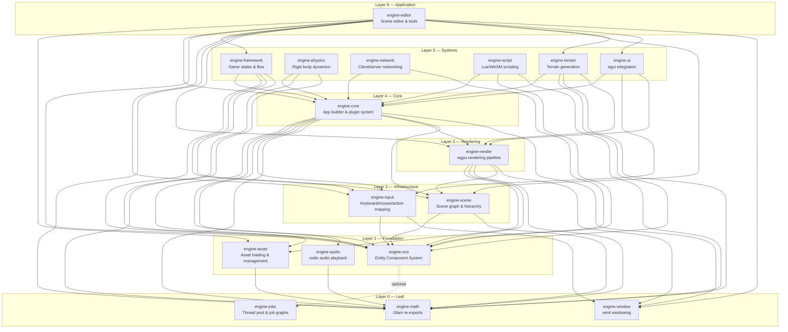
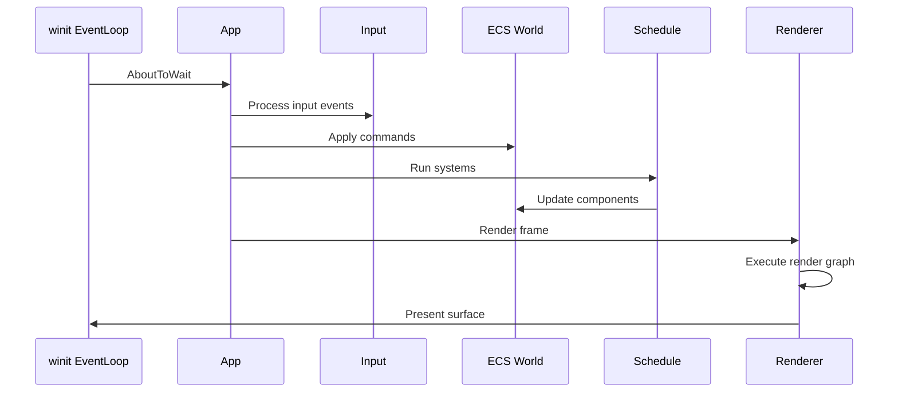
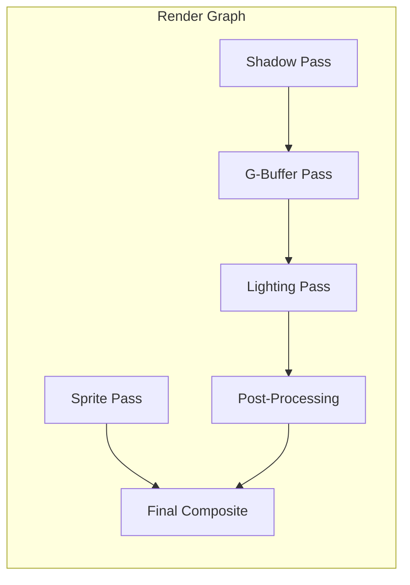

# Architecture Overview

RustEngine is a modular game engine built in Rust with 16 crates organized in layers. This document describes the high-level architecture, crate relationships, and data flow.

## Validated Dependency Layers

All inter-crate dependencies flow downward only. No circular or upward dependencies exist (verified via `cargo tree`).

```
Layer 0 (Leaf):           engine-math, engine-jobs, engine-window
Layer 1 (Foundation):     engine-audio, engine-asset, engine-ecs
Layer 2 (Infrastructure): engine-scene, engine-input
Layer 3 (Rendering):      engine-render
Layer 4 (Core):           engine-core
Layer 5 (Systems):        engine-framework, engine-physics, engine-network,
                          engine-script, engine-ui, engine-terrain
Layer 6 (Application):    engine-editor
```

## Crate Dependency Graph



## Layer Descriptions

### Layer 0 — Leaf

No engine-* dependencies. Pure utility crates.

| Crate | Purpose | Key Dependencies |
|-------|---------|-----------------|
| **engine-math** | Re-exports `glam` types (`Vec2/3/4`, `Mat4`, `Quat`) with extension traits | `glam` |
| **engine-jobs** | Thread pool, job graphs, task scheduling | `crossbeam`, `rayon` |
| **engine-window** | Window creation via winit 0.30 | `winit` |

### Layer 1 — Foundation

Depend only on Layer 0 crates.

| Crate | Purpose | Key Dependencies |
|-------|---------|-----------------|
| **engine-audio** | Audio playback via rodio, mixer buses, spatial audio, streaming | `rodio`, engine-math |
| **engine-asset** | Asset handles (`Arc` ref-counting), type registry, file watcher, loaders (image, glTF, audio) | `notify`, `image`, `gltf`, engine-math |
| **engine-ecs** | Sparse-set ECS: entities, components, queries, schedules | `rayon`, optional engine-jobs |

### Layer 2 — Infrastructure

Depend on Layers 0–1.

| Crate | Purpose | Key Dependencies |
|-------|---------|-----------------|
| **engine-scene** | Scene nodes, parent-child hierarchy, Transform/GlobalTransform sync, prefabs, animation state | engine-ecs, engine-math |
| **engine-input** | Keyboard/mouse state tracking, action maps, input bindings | engine-ecs, engine-window |

### Layer 3 — Rendering

Depend on Layers 0–2.

| Crate | Purpose | Key Dependencies |
|-------|---------|-----------------|
| **engine-render** | wgpu renderer, render graph, sprite/PBR pipelines, camera, lighting, shadows, particles, tilemap | `wgpu`, engine-asset, engine-ecs, engine-math, engine-scene, engine-window |

### Layer 4 — Core

Depend on Layers 0–3. Central integration point.

| Crate | Purpose | Key Dependencies |
|-------|---------|-----------------|
| **engine-core** | `AppBuilder`, plugin system, time management, config, logging, profiler | engine-asset, engine-audio, engine-ecs, engine-input, engine-math, engine-render, engine-scene, engine-window |

### Layer 5 — Systems

Depend on engine-core (Layer 4) and lower layers.

| Crate | Purpose | Key Dependencies |
|-------|---------|-----------------|
| **engine-framework** | Game state stack, standard game flow (title→menu→game→pause→gameover), save system | engine-core, engine-ecs, engine-input, engine-scene |
| **engine-physics** | Rigid bodies, colliders, collision detection (SAT), contact solving, joints, CCD | engine-core, engine-ecs, engine-math |
| **engine-network** | Message serialization, client/server, authoritative mode, snapshot sync, NAT traversal | engine-core, engine-ecs |
| **engine-script** | Lua (mlua) and WASM scripting, component bridge, hot-reload, event bus | `mlua`, `wasmtime`, engine-core, engine-ecs, engine-math |
| **engine-ui** | egui integration, theming, layout, retained mode widgets, animations | `egui`, engine-core, engine-input, engine-render |
| **engine-terrain** | Terrain generation, LOD, chunking | engine-core, engine-ecs, engine-math, engine-render |

### Layer 6 — Application

Depend on all lower layers.

| Crate | Purpose | Key Dependencies |
|-------|---------|-----------------|
| **engine-editor** | Scene editor UI, hierarchy panel, inspector, gizmos, undo/redo, scene serialization | engine-asset, engine-core, engine-ecs, engine-framework, engine-input, engine-math, engine-render, engine-scene, engine-terrain, engine-ui, engine-window |

## Data Flow

### Frame Lifecycle



### ECS System Execution

Systems are registered via the plugin system and run in a `Schedule`:

1. **Startup systems** — Run once after app initialization
2. **Pre-update systems** — Input processing, event handling
3. **Update systems** — Game logic, physics, animation
4. **Post-update systems** — Transform sync, camera sort
5. **Render systems** — Collect draw calls, submit to GPU

### Render Pipeline



## Plugin System

The engine uses a plugin architecture for modularity:

```rust
use engine_core::app::AppBuilder;
use engine_core::plugin::Plugin;

struct MyPlugin;

impl Plugin for MyPlugin {
    fn build(&self, app: &mut AppBuilder) {
        // Register systems, resources, event handlers
        app.add_system(my_system);
        app.insert_resource(MyResource::default());
    }
}
```

Plugins can:
- Register ECS systems (startup, update, render)
- Insert global resources
- Register event handlers
- Configure the renderer
- Add custom asset loaders

## Feature Flags

| Crate | Feature | Description |
|-------|---------|-------------|
| `engine-core` | `audio` (default) | Enable audio system via `engine-audio` |
| `engine-ecs` | `jobs-backend` | Use `engine-jobs` for parallel system execution |

## Cross-Platform Support

The engine supports Windows, macOS, Linux, and Android (experimental) through:
- **wgpu** for cross-platform GPU abstraction
- **winit** for window management
- **rodio** for audio (with platform-specific backends)
- Conditional compilation via `#[cfg(target_os = "...")]` where needed
