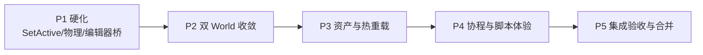

# Unity 对齐：后续执行计划

**分支：** `unity-lifecycle-refactor`  
**基线提交：** `e60b820`（feat(engine-core): align runtime with Unity lifecycle and asset contracts）  
**目标：** 在已接通的运行时契约之上，继续收敛双 World、补全脚本/编辑器侧缺口，并保证每步可验证、可合并。

---

## 0. 当前基线（已完成，勿重做）

| 能力 | 状态 | 关键模块 |
|------|------|----------|
| FixedUpdate 累加器 + 0+ 步/帧 | ✅ | `time.rs` |
| App 主循环 Fixed→Update→Late→EoF | ✅ | `app.rs`, `player_loop.rs` |
| SceneRuntime（Unity World 挂 ECS App） | ✅ | `scene_runtime.rs`, `plugins.rs` |
| SceneManager JSON 加载/卸载/DontDestroyOnLoad | ✅ | `scene_management.rs` |
| SetActive → OnEnable/OnDisable（级联，帧末 flush） | ✅ | `world.rs` |
| Destroy 延迟 + OnDisable→OnDestroy | ✅ | `world.rs` |
| RequireComponent（`required_on_add`） | ✅ | `component.rs`, `world.rs` |
| Invoke / InvokeRepeating | ✅ | `world.rs` |
| Coroutine 步进（Wait/SetActive/Call/Action） | ✅ | `coroutine.rs` |
| Prefab Variant（base + path override） | ✅ | `prefab.rs` |
| ScriptableObject `.asset` + `.meta` GUID | ✅ | `scriptable_asset.rs`, `asset_database.rs` |
| 文档 `lifecycle-and-scenes.md` | ✅ | `docs/` |

**测试基线：** lib 192 + unity_api 20 + completion 40 + monobehaviour 4 = **256 passed**  
**约定：** 每阶段结束跑 `cargo test -p engine-core --lib` + 相关集成测；改公共 API 必须同步 `docs/lifecycle-and-scenes.md`。

---

## 阶段目标总览



| 阶段 | 主题 | 预估规模 | 风险 | 可独立合并 |
|------|------|----------|------|------------|
| P1 | 运行时硬化 + 编辑器桥 | S–M | 低 | ✅ |
| P2 | 双 World 收敛 | L | 高 | ✅（feature 切换） |
| P3 | 资产管线深化 | M | 中 | ✅ |
| P4 | Coroutine / 脚本体验 | M | 低 | ✅ |
| P5 | 验收、文档、合并 main | S | 低 | ✅ |

---

## P1 — 运行时硬化 + 编辑器桥（优先，1–2 天）

### 目标
把「能跑」变成「编辑器与物理真正吃上新生命周期」，不改架构。

### 任务

| ID | 任务 | 文件 | 验收标准 |
|----|------|------|----------|
| P1.1 | **SetActive 即时派发可选模式** | `world.rs` | `SetActiveImmediate` 当场 flush OnEnable/OnDisable；默认仍帧末队列。测试：SetActive 后立即计数回调。 |
| P1.2 | **物理固定步挂钩** | `app.rs`, `engine-physics` | `run_with_lifecycle` 在 FixedUpdate 步内调用 `PhysicsWorld::step(fixed_delta)`；`PhysicsPlugin` 注册到 FixedUpdate 相位。测试：dt=0.1 时 step 次数 = pending_fixed_steps。 |
| P1.3 | **编辑器 SceneRuntime 接入** | `engine-editor/src/state.rs` | EditorState 的 `engine_core::World` 明确为 SceneRuntime 内 World（或双向 sync API）。保存/加载场景走 `SceneManager`/`serialization`。 |
| P1.4 | **AddMonoBehaviour 在 AddComponent 路径可见** | `world.rs` | MonoBehaviour 同时进 component 列表（可 GetComponent）与 monobehaviour 槽（可 tick）。避免双份状态：holder 为唯一源。 |
| P1.5 | **Pending destroy 与 Invoke 清理** | `world.rs` | Destroy 对象时取消其 Invoke/Coroutine；测试覆盖。 |
| P1.6 | **集成测试** | `tests/unity_lifecycle_tests.rs` | 端到端：spawn → SetActive false/true → Invoke → Coroutine → Destroy，断言回调顺序。 |

### 退出条件
- [ ] 物理在 FixedUpdate 内 step，且受 timeScale 影响
- [ ] 编辑器加载/保存场景与运行时 Scene JSON 格式一致
- [ ] 新增 lifecycle 集成测试全绿
- [ ] 文档补「编辑器如何用 SceneRuntime」

### 提交建议
`feat(engine-core): harden SetActive, physics fixed-step, editor SceneRuntime bridge`

---

## P2 — 双 World 收敛（核心架构，2–4 天）

### 目标
对外 **只暴露 Unity World**；ECS 降为内部实现细节。消除编辑器/脚本/渲染三套句柄语义。

### 现状问题
```
App.world          → engine_ecs::World     (系统/渲染)
SceneRuntime.world → engine_core::World    (脚本/场景图)
EditorState.world  → engine_core::World    (层级/Inspector)
engine-scene       → 自己的 Node/Transform (第三套)
```

### 方案（推荐：渐进收敛，不一次重写）

**P2.a — 身份桥（先做）**
| ID | 任务 | 说明 |
|----|------|------|
| P2.1 | `GameObjectHandle` ↔ ECS `Entity` 双向映射表 | SceneRuntime 创建 GO 时可选镜像 entity；记录在 `World` 内 `handle_to_entity` |
| P2.2 | 渲染组件桥 | 从 Unity World 的 Material/MeshRenderer/Sprite 同步到 ECS 组件，供 `render_phase` 消费 |
| P2.3 | 统一 `App::unity_world()` API | 优先 SceneRuntime；无则报错。逐步改示例 |

**P2.b — 存储合并（后做，大）**
| ID | 任务 | 说明 |
|----|------|------|
| P2.4 | 将 `gameobject_data`/`transforms`/`monobehaviours` 迁入 ECS 资源或组件 | dual-read + Transform/Hierarchy/Active/MBTypes **写通已完成**（含 B1 回填、B2 写路径收敛、B3 层级双读、B4 Destroy 一致）；完整数组权威迁移 → 见 P2.12 |
| P2.5 | 弃用 `engine-scene` 中重复 Transform | **盘点 + 模块 doc 完成**；`scene_bridge` 为可选桥；动画 keyframe / `collect_system` GlobalTransform 仍依赖 engine-scene；C1 收集系统数据源 → 见 P2.13 |
| P2.6 | Editor 只依赖 `engine_core::world::World` | 视口/命令/`new_scene` 已对齐 World；打开优先 `.runtime.json` 孪生；自动保存走 `save_scene_bundle`；旧 ECS Scene 仅作回退 | 大部分 ✅ |
| P2.7 | 自动链接全部 Unity 对象 | `IdentityBridge::ensure_all_linked`；`sync_all` / `run_with_lifecycle` 自动 adopt ✅ |
| P2.8 | 统一 App 入口 | `unity_world` / `unity_world_ref` / `require_unity_world` / `link_unity_scene` ✅ |
| P2.9 | 渲染消费身份桥 | `render_phase` 合并 `TransformProxy`+`RenderProxy` → `Sprite`（白纹理兜底） ✅ |
| P2.10 | 编辑器双写场景 | `save_scene_bundle`：编辑器 Scene + `.runtime.json`（SceneData）；`open_scene_file` 优先 SceneData ✅ |
| P2.11 | 编辑器 Play → SceneRuntime | `UnityPlayHost`：克隆层级 + FixedUpdate 物理步进（Rigidbody→PhysicsWorld）✅ |
| P2.12 | B5：MB 可恢复实例进 ECS | `MonoBehaviourInstances`（type_name+enabled+props）；`restore_monobehaviours_from_ecs`；SceneData 往返 | ✅ |
| P2.13 | C1：光源收集数据源 | `light_collect_system` 优先 TransformProxy，回退 GlobalTransform；`TransformProxy` 定义在 `engine-render`；不改 Pass 内部 | ✅ |
| P2.14 | D2：内置样例 MB 注册 | `sample_scripts`：Mover/Rotator/Lifetime；`CorePlugins` 自动 `register_sample_scripts`；SceneData 往返测试 | ✅ |

### 风险控制
1. 全程用 feature flag：`unity-world-primary`（默认 off）
2. 每步保证 `cargo test -p engine-core -p engine-editor` 绿
3. **禁止** 同时改渲染 Pass 内部；只改「数据从哪来」

### 退出条件
- [x] 示例游戏只调用 Unity World API（`unity_gameplay_demo`）
- [x] Editor 与运行时同一套 World 类型（Play 克隆 SceneRuntime World；打开/自动保存优先 SceneData）
- [x] 渲染帧数据来自桥接：`render_phase` 消费 TransformProxy/RenderProxy；编辑器 3D 位姿以 World 为准（mesh 列表仍来自节点树，非 engine-scene Transform）

### 提交建议
`refactor(engine-core): bridge Unity World to ECS entities` → `refactor: converge dual worlds behind unity-world-primary`

---

## P3 — 资产管线深化（1–2 天）

### 任务

| ID | 任务 | 文件 | 验收 |
|----|------|------|------|
| P3.1 | Asset 热重载 | `scriptable_asset.rs`, `asset_database.rs` | 文件 mtime 变化后 `reload_guid` 刷新内存；事件 `AssetReloaded` | ✅ |
| P3.2 | 引用字段 | 资产内 `AssetRef { guid }` | 序列化稳定；加载时解析到 Handle | ✅ |
| P3.3 | 场景引用资产 | `serialization.rs` | SceneData 组件属性支持 guid；Material/SpriteRenderer 内置序列化 | ✅ |
| P3.4 | 与 engine-asset 对齐 | 调研 `engine-asset` 的 Handle/GUID | 文档写清两套资产系统关系；能共存则桥，不能则标为 Phase 6 | 双轨共存 |
| P3.5 | 工具：`so_asset pack/unpack` | `src/bin/so_asset.rs` | 递归扫描生成 meta；`pack` / `list` | ✅ |

### 退出条件
- [x] 改磁盘 `.asset` 后内存值可刷新（`poll_hot_reload`；编辑器每帧 / `run_with_lifecycle` 轮询）
- [x] 场景里可引用共享 EnemyData 而不复制（SceneData `AssetRef` + `resolve_ref` 测试）

### 提交建议
`feat(asset): hot-reload ScriptableObjects and asset references`

---

## P4 — Coroutine / 脚本体验（1 天）

| ID | 任务 | 验收 |
|----|------|------|
| P4.1 | `MonoBehaviour::StartCoroutine` 默认转发到 World | 脚本内可 `ctx.world.StartCoroutine` | ✅ Context 转发 |
| P4.2 | `WaitUntil` / `WaitWhile` 条件等待 | 闭包或消息条件 | ✅ |
| P4.3 | 协程与 DontDestroyOnLoad | 场景卸载时停止非持久对象协程 | ✅ |
| P4.4 | 示例 `coroutine_demo` | 可运行 example | ✅ |
| P4.5 | SendMessage 真分发 | MonoBehaviour 上按方法名表或 `fn on_message`；Invoke/Coroutine::Call 可达 | ✅ |
| P4.6 | `WaitForSecondsRealtime` + `StopCoroutine(string)` | `WaitRealtime`；`StopCoroutineByName` | ✅ |

### 提交建议
`feat(script): WaitRealtime, StopCoroutineByName, WaitFixedUpdate, coroutine_demo`

---

## P5 — 验收与合并（0.5–1 天）

| ID | 任务 |
|----|------|
| P5.1 | 全量：`cargo fmt && cargo clippy -p engine-core`（既有 non_snake_case 警告保留基线） |
| P5.2 | `cargo test -p engine-core`（lib + 全部 tests） |
| P5.3 | `cargo test -p engine-editor --test editor_tests`（修复既有 `new_with_name` 若仍失败） |
| P5.4 | 更新 `README.md` 开发路线图勾选状态 |
| P5.5 | 更新 `PROJECT_SUMMARY.md` |
| P5.6 | PR 描述：对照 Unity 十条契约的覆盖表 |
| P5.7 | 合并策略：squash 或 merge commit 到 `main`（**本迭代不合并**） |

---

## 推荐执行顺序（本周）

```
Day 1  P1.2 物理固定步 + P1.5 清理 + P1.6 集成测     → commit A
Day 1  P1.1 SetActive 即时模式 + P1.4 Mono 双可见     → commit B
Day 2  P1.3 编辑器桥                                  → commit C
Day 3  P2.1–P2.3 身份桥 + 渲染桥                      → commit D
Day 4  P4.1–P4.4 协程体验（穿插）                     → commit E
Day 5  P3.1 热重载                                    → commit F
Day 6+ P2.b 存储合并（可延后到下个迭代）              → 独立 PR
```

**明确不做（本迭代）：**
- VR/AR、Android 运行时
- 完整 Mecanim 状态机重写
- 把 engine-scene 整包删除（只去重 Transform，不删动画/IK）
- WASM 上的 SceneRuntime 全量（可后置 feature）

---

## 每阶段 Definition of Done

1. 相关 `cargo test` 全绿  
2. `docs/lifecycle-and-scenes.md` 与 API 同步  
3. 一个清晰 commit message（feat/fix/refactor(scope)）  
4. 不引入新的 `unsafe`（除非已有模式且注明）  
5. 公共 API 变更在 migration-guide 增加一行映射  

---

## 验收清单（对照 Unity 十条契约）

| # | 契约 | 现状 | 备注 |
|---|------|------|------|
| 1 | 实体-组件组合，Transform 强制 | ✅ 主路径 | 双 World 并存；存储合并 P2.4 延后 |
| 2 | 引擎主循环回调 | ✅ | PlayerLoop Fixed→Update→Late→EoF |
| 3 | 全局 Awake 门闩 | ✅ | `SceneRuntime.awake_started` |
| 4 | Fixed / Update / Late 三相 | ✅ | MonoBehaviour + ECS fixed schedule |
| 5 | 固定步长物理 + 钳制 | ✅ | `PhysicsPlugin` → FixedUpdate schedule；Time 钳制 |
| 6 | deltaTime / timeScale | ✅ | 含 unscaled / WaitRealtime |
| 7 | 延迟销毁 + OnDisable/OnDestroy | ✅ | 含 Invoke/Coroutine 取消 |
| 8 | Prefab 模板-实例-覆盖 | ✅ Variant | 与 World 实例覆盖弱耦合 |
| 9 | Scene 可加载/叠加边界 | ✅ | 编辑器双写 + Play 克隆加载 |
| 10 | 共享数据资产 | ✅ | `.asset`+GUID、热重载、SceneData AssetRef |

**验收（2026-09）**

- `cargo test -p engine-core` / `cargo test -p engine-editor --test editor_tests` 全绿  
- 示例：`coroutine_demo`、`runtime_scene_demo`、`unity_gameplay_demo`、`so_asset`  
- Unity 主路径：`main`（`unity-lifecycle-refactor` 已合入远程）  
- 视口权威后续：`p2-viewport-unity-source`  
- 合视口分支：`git checkout main && git merge --no-ff p2-viewport-unity-source`

### PR 描述草稿（P5.6，合并时用）

**Summary**
- Unity PlayerLoop / MonoBehaviour 生命周期（Fixed→Update→Late→EoF）
- SceneRuntime + SceneManager（加载/卸载/DDOL）；身份桥 auto-link 与 render_phase 消费
- 编辑器：双写 `.runtime.json`、Play 模式 `UnityPlayHost` 驱动 SceneRuntime
- 脚本：Wait/WaitRealtime/WaitUntil/WaitWhile、StopCoroutineByName
- 资产：`.asset`+GUID 热重载、SceneData AssetRef；内置 Material/Sprite/Rigidbody/Audio/Light/Camera/ScriptBehaviour 序列化；`so_asset` CLI

**Out of scope**
- P2.4/P2.5 双 World 存储完全合并
- engine-scene 整包删除

**Test plan**
- [x] `cargo test -p engine-core`
- [x] `cargo test -p engine-editor --test editor_tests`
- [x] `coroutine_demo` / `runtime_scene_demo` 本地运行

## 立即可做的第一个任务（历史，已完成）

---

## 立即可做的第一个任务

**P1.2 Physics FixedUpdate 集成**

1. 读 `engine-physics/src/plugin.rs`、`world.rs`（physics）  
2. 在 `App::run_with_lifecycle` 的 Fixed 循环内：`begin_fixed_update` → physics step → MonoBehaviour Fixed → `end_fixed_update`  
3. 测试：`pending_fixed_steps` 与 mock step 计数一致  
4. 文档一段「物理应在 FixedUpdate」

完成后 commit，再进入 P1.6 集成测试。
